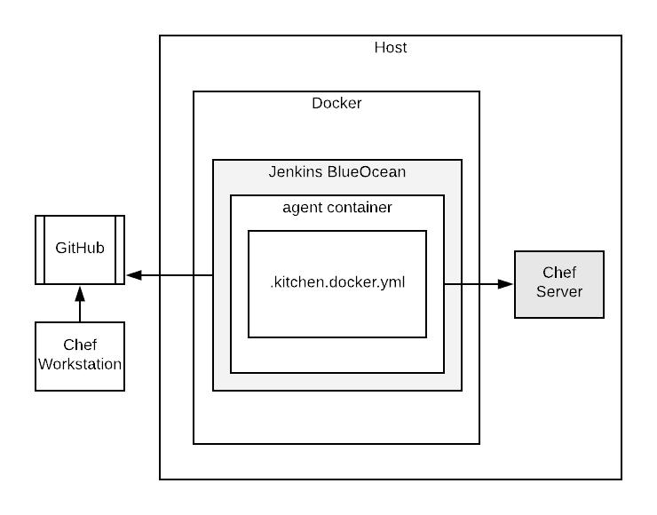

# jenkins-cookbook-pipeline

A proof-of-concept, multi-purpose repo for testing and publishing cookbooks using Jenkins Docker containers.

In current form, this is best suited for creating a quick and dirty, on-the-fly, cookbook pipeline and works nicely as an ephemeral pipeline for local development. Careful considerations should be made before porting any of this functionality to a production environment.

What this does:
1. creates a fresh jenkins install with a blueocean container
1. installs plugins, configures and turns off the install wizard
1. creates Admin user
1. integrates with github repo and pulls/runs Jenkinsfile from a given cookbook repo
1. creates a jenkins builder container (inside master) to run pipeline
1. runs .kitchen.docker.yml (inside builder)
1. runs cookbook validations and publishes the master branch to a Chef Server on Host network
1. continues watching repo until destroyed



## Known Issues

- The setup_jenkins.sh file is heavily dependent on static environment variables.
- keys and configurations need to added to jenkins-master dir.


## Jenkins Master setup files

- ./jenkins-master/*

### Usage

1. Add these files to the jenkins-master directory. This is the Jenkins Master Docker build context and the following files are used to build the container
  - jenkins-master/cicdsvc-knife.rb
    A knife configuration file with the appropriate configuration for your environment
  - jenkins-master/cicdsvc.pem
    A client.pem key for the user specified in the knife.rb file
  - create jenkins-master/github-token file containing a valid github token
    A [Github Access Token](https://help.github.com/articles/creating-a-personal-access-token-for-the-command-line/) with repo and user email access to the cookbook repo

1. Edit setup_jenkins.sh and set Environment variables appropriately

1. Run ./jenkins-master/setup_jenkins.sh  

## Jenkins Library

This will run the bare bones basics of a cookbook pipeline.
- Unit tests with chefspec
- Linting with foodcritic and cookstyle
- Functional tests with TestKitchen
- Publishing to a Chef Server

### Library files

- ./vars/publishMaster.groovy
- ./resources/Dockerfile (Jenkins Builder)
  A Dockerfile for running a cookbook builder inside the jenkinsci/blueocean Jenkins container

### Usage

A [bundle of bash hackery](https://github.com/mtyler/chef-evaluation) to setup Chef infrastructure with a cookbook pipeline.

A [Jenkinsfile](https://github.com/mtyler/chef-infra-base/blob/master/Jenkinsfile) that dynamically imports the pipeline library.

```javascript
// Dynamically include a jenkins library
library identifier: 'jenkins-cookbook-pipeline@master', retriever: modernSCM(
  [$class: 'GitSCMSource',
   remote: 'git://github.com/mtyler/jenkins-cookbook-pipeline.git'])

// Call groovy method containing shared pipeline.
// Argument should be the name of the cookbook
node {
  publishMaster 'chef-infra-base'
}
```

## More Jenkins Cookbook Libraries

This library by James Massardo is more robust and provides more functionality.  Especially, if you are coordinating between OS & Apps teams and multiple BUs.
[https://github.com/jmassardo/Chef-Jenkins-Library](https://github.com/jmassardo/Chef-Jenkins-Library)
